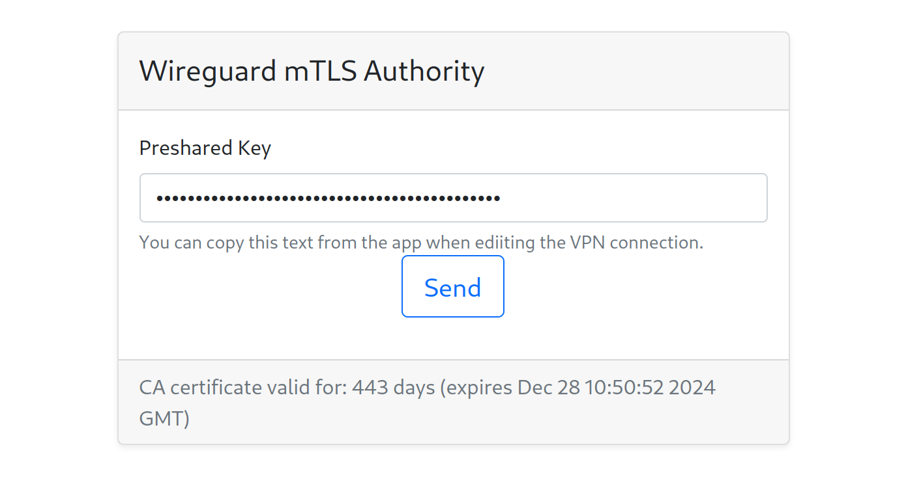

# Wireguard mTLS Authority

This utility generates mTLS certificates for clients that can access the network via WireGuard VPN.

## Use case

* home lab has Wireguard server set up
  * clients are managed via [wireguard-ui](https://github.com/ngoduykhanh/wireguard-ui)
* phone has Wireguard client but some applications require non-VPN access (e.g. in case of packet filtering on public wifi)
  * toggling the VPN connection on and off is a hassle
* home lab services need secure connection when accessed from the public internet (client TLS authentication)

## Installation

In a `docker-compose` setup, clone this repository in a subfolder next to the `docker-compose.yml` file. Attach the volumes like this:

```yml
  wireguard-mtls-authority:
    build: ./wireguard-mtls-authority
    restart: unless-stopped
    volumes:
      - '/my_apps_path/wireguard_ui/db:/etc/db:ro'
      - '/my_apps_path/reverse_proxy/tls:/etc/ca:ro'
```

Set up a reverse proxy for the protected services to check clients against the same CA certificate and reject invalid requests like this with `nginx`:

```
        ssl_client_certificate /my_apps_path/reverse_proxy/tls/my_ca_cert.crt;
        ssl_verify_client optional;
        
        if ($ssl_client_verify != SUCCESS) {
            return 444;  # nothing is sent back
        }
```

Also set up a reverse proxy for this application (or use the exposed port directly). Do not expose it to the public internet and do not require mTLS for it.

## Usage

Navigate to the webapp's address and enter the _preshared key_ value from the Wireguard client configuration. This can be copied from the app when editing the VPN connection.

## Developer notes

The app was initially developed for OpenSSL v3 but the `node` container has v1 installed, so it has been backported. Compatibility with both versions was not required for the containerized use-case.

